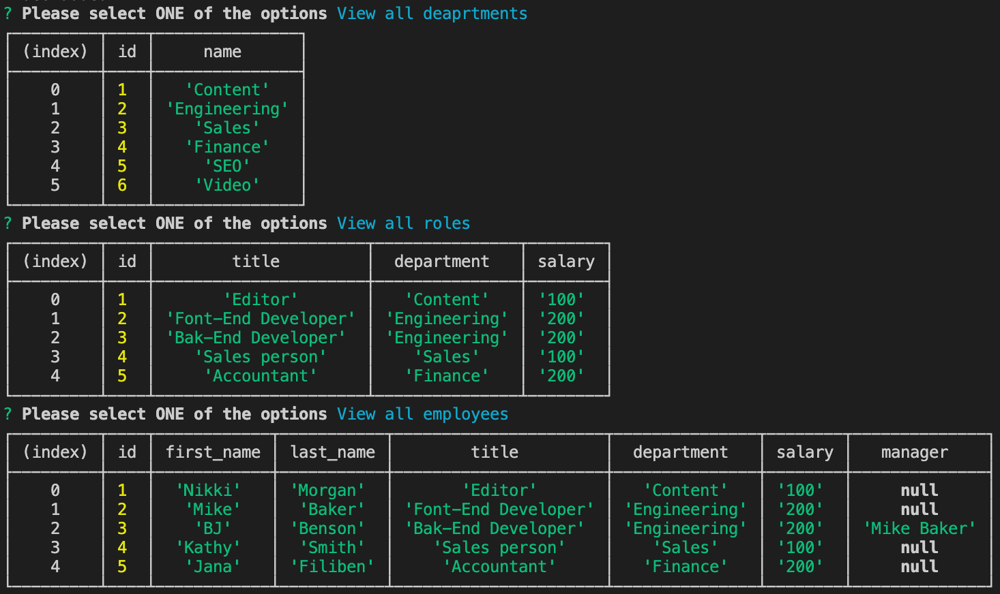

# Employee Tracker
AS A business owner
I WANT to be able to view and manage the departments, roles, and employees in my company
SO THAT I can organize and plan my business

## Table of Contents
* [How it works](#how-it-works)
* [Features](#features)
* [Technoliges Used](#technologies-used)
* [Walkthrough Video](#walkthrough-video)

## How it works:
- open `integrated terminal`, then run `npm start`
- select one from the list  -- VIEW or ADD
- select `quit` whenever you are done with the app
### Notes:
All views & add department works at this moment. 
Add roles/employees show the prompts, but not adding it to the table yet.

## Features:
- When the user select ***VIEW department/roles/employees***, the table of the selection appear on the terminal
### Example:


## Technologies Used:
1. 
```sql
CREATE TABLE employee (
  id INTEGER AUTO_INCREMENT PRIMARY KEY,
  first_name VARCHAR(30) NOT NULL,
  last_name VARCHAR(30) NOT NULL,
  role_id INTEGER NOT NULL,
  CONSTRAINT fk_role FOREIGN KEY (role_id) REFERENCES role(id) ON DELETE CASCADE,
  manager_id INTEGER,
  CONSTRAINT fk_manager FOREIGN KEY (manager_id) REFERENCES employee(id) ON DELETE SET NULL
);
```

2. console.table
```javascript
function viewDepartment() {
  db.viewDepartment()
    .then(([rows]) => {
      const departments = rows;
      console.table(departments);
    })
    .then(() => initialPrompt());
}
```

## Walkthrough Video
https://drive.google.com/file/d/1R7_DJQJp73ytsNl2M87OBeewjCfAqcA4/view?usp=sharing

